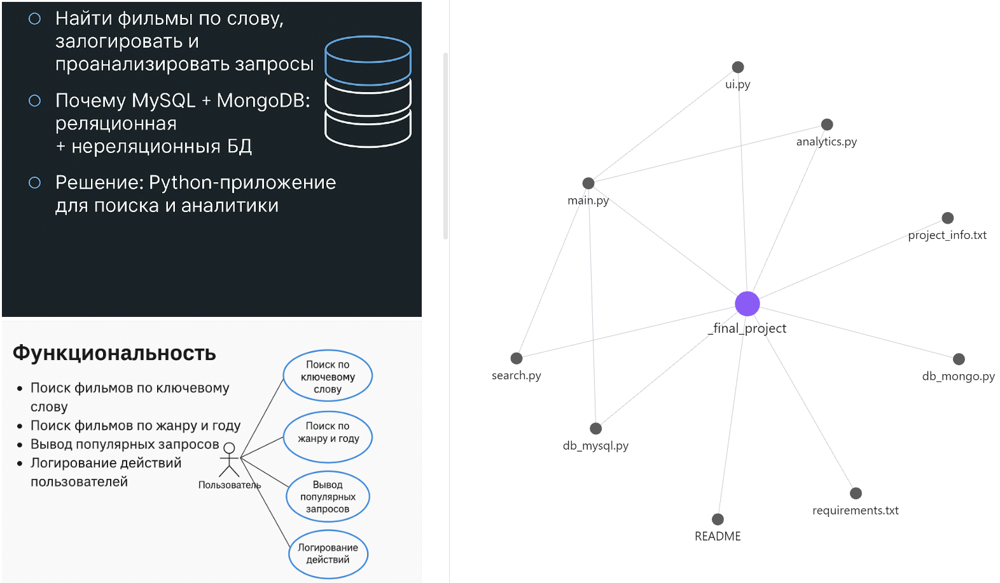

# 🎬 Консольное приложение для работы с базой данных Sakila

## 📌 Описание

Это консольное Python-приложение, которое подключается к базе данных Sakila (MySQL) и позволяет:

- выполнять поиск фильмов по названию или по жанру и году;
- отображать топ-5 популярных запросов;
- выводить последние 5 выполненных запросов (MongoDB);
- логировать действия пользователя (время, параметры запроса);
- выводить результаты в виде таблиц с помощью библиотеки `tabulate`.

Проект реализован в рамках курса **"Курс по Python"** (2025).

## ⚙️ Стек технологий

- Python 3.12
- MySQL (через `mysql-connector-python`)
- MongoDB (через `pymongo`)
- `tabulate` (табличный вывод)
- dotenv (`python-dotenv`)
- VS Code

## 🗂️ Структура проекта

```
_final_project/
├── main.py             # Точка входа в приложение
├── ui.py               # Отдельный модуль для взаимодействия с пользователем
├── db_mysql.py         # Подключение и работа с MySQL
├── db_mongo.py         # Подключение и логирование в MongoDB
├── search.py           # Функции поиска фильмов
├── analytics.py        # Функции аналитики поисков
├── .env                # Конфигурация подключения к БД
├── requirements.txt    # Зависимости
├── README.md           # Описание проекта
└── project_info.txt    # Общая информация о проекте
```
## 🧠 Визуальная структура проекта (Obsidian Graph)



## 🔧 Установка

1. Установить зависимости:
```bash
pip install -r requirements.txt
```

2. Создать файл `.env` по примеру `.env.example`

3. Запустить:
```bash
python main.py
```

## 📝 Автор

Michael Gris  
Balingen, Germany · 2025